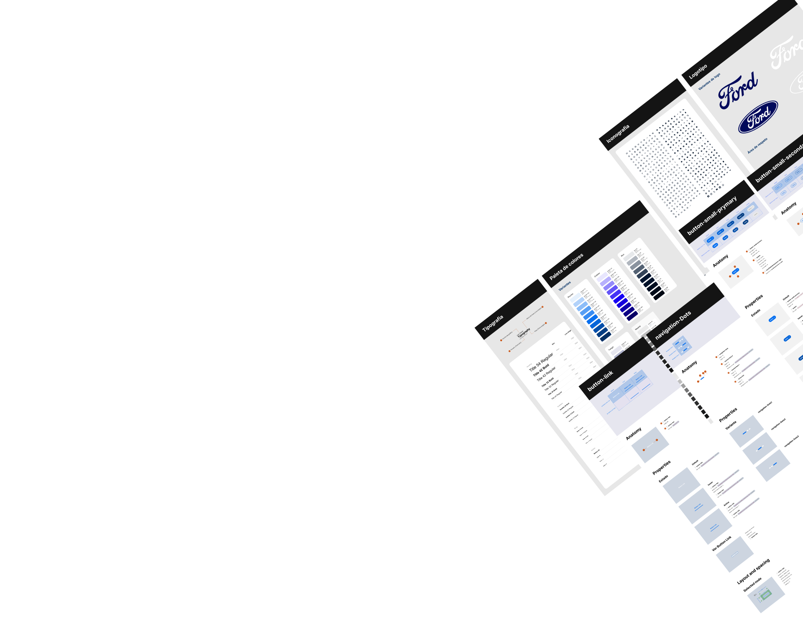

# Ford Design System - Documentation Project 🚗💨



Bienvenido al repositorio oficial del **Sistema de Diseño de Ford**. Este proyecto es una biblioteca de componentes y guías visuales diseñada para estandarizar la experiencia de usuario en todos nuestros productos digitales, garantizando consistencia, accesibilidad y escalabilidad.

## 🌟 Demo en Vivo
Puedes ver la documentación interactiva desplegada en GitHub Pages:
👉 [**Ford Design System Live Demo**](https://davidgutierrez27.github.io/Ford-Design-System/)

## 🚀 Tecnologías y Arquitectura
El proyecto está construido bajo una filosofía de **"Modern Lean Web"**:
- **HTML5 Semántico** para la estructura.
- **Sass (SCSS)** con una arquitectura de **Diseño Atómico**.
- **JavaScript Vanila** para la lógica de componentes y el sistema de navegación **SPA (Single Page Application)**.
- **CSS Variables (Design Tokens)** para una gestión dinámica de temas (Light/Dark mode).

## 📂 Estructura del Proyecto

```text
/
├── assets/             # Imágenes, iconos y recursos multimedia
├── css/                # CSS compilado (No editar directamente)
├── js/                 # Lógica del sistema
│   ├── core/           # Router (SPA) y lógica central
│   ├── components/     # Comportamiento de componentes específicos
│   └── search.js       # Buscador global
├── pages/              # Fragmentos HTML de las vistas (inyectados por el router)
│   ├── foundations/    # Colores, Tipografía, Grilla, Espaciado, etc.
│   └── components/     # Átomos, Moléculas y Organismos
├── scss/               # Código fuente de estilos
│   ├── base/           # Resets y estilos globales
│   ├── components/     # Estilos de componentes (Atoms, Molecules, Organisms)
│   ├── documentation/  # Estilos específicos del sitio de docs
│   └── _tokens.scss    # Definición de Design Tokens
├── index.html          # Shell de la aplicación
└── package.json        # Dependencias y scripts
```

## 🛠️ Guía de Desarrollo

### Requisitos Previos
- Node.js instalado.
- Un servidor local (como "Live Server" en VS Code).

### Instalación y Compilación
1. Clona el repositorio.
2. Instala las dependencias:
   ```bash
   npm install
   ```
3. Compila los estilos en tiempo real:
   ```bash
   npm run sass
   ```
4. Para una compilación final de producción:
   ```bash
   npm run build
   ```

## 🎨 Principios de Diseño
- **Consistencia:** Uso riguroso de tokens predefinidos.
- **Accesibilidad:** Cumplimiento de estándares WCAG.
- **Modularidad:** Componentes independientes y reutilizables.
- **Performance:** Carga dinámica de vistas sin recargas de página.

## ✍️ Autor
**David Gutierrez** - *Design System Lead & Front-end Developer*
- LinkedIn: [Visita mi perfil](https://www.linkedin.com/in/fernando-david-gutierrez-b1a612316/)
- Sitio Web: [davidgutierrez.design](https://davidgutierrez.design) (Próximamente)

---
*Este proyecto es parte de la iniciativa de estandarización digital de Ford Experience.*
